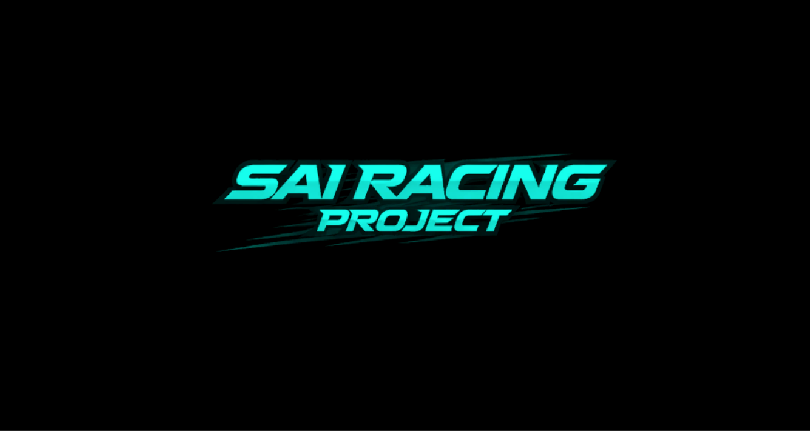
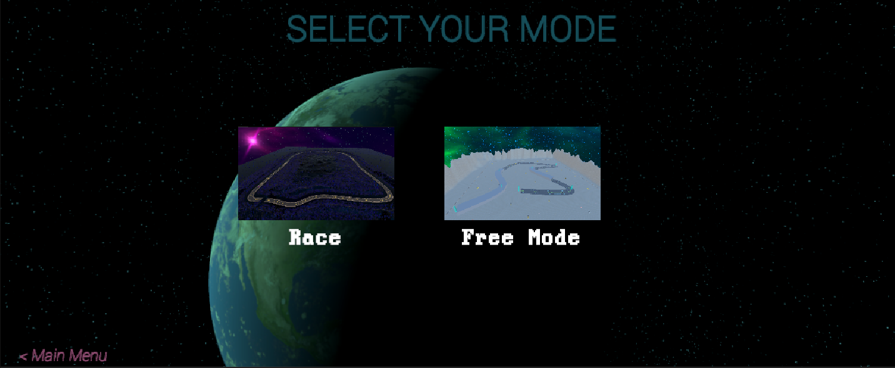
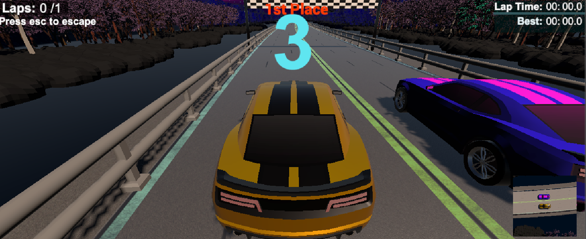
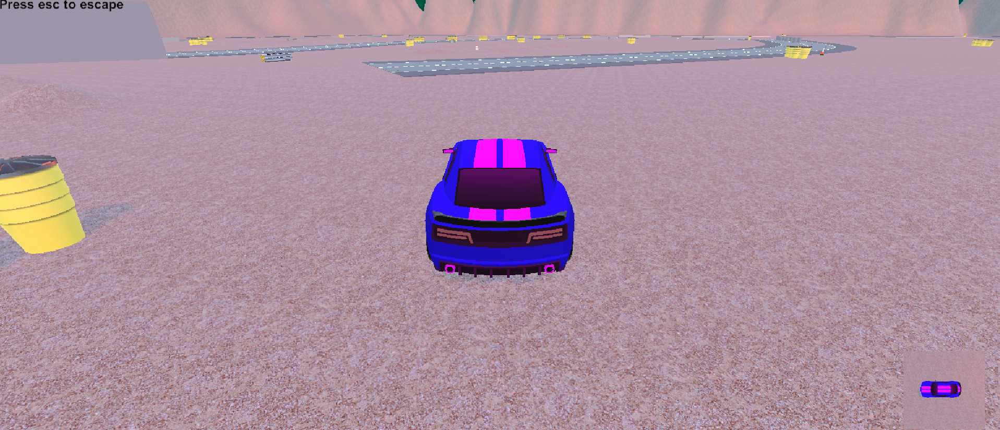
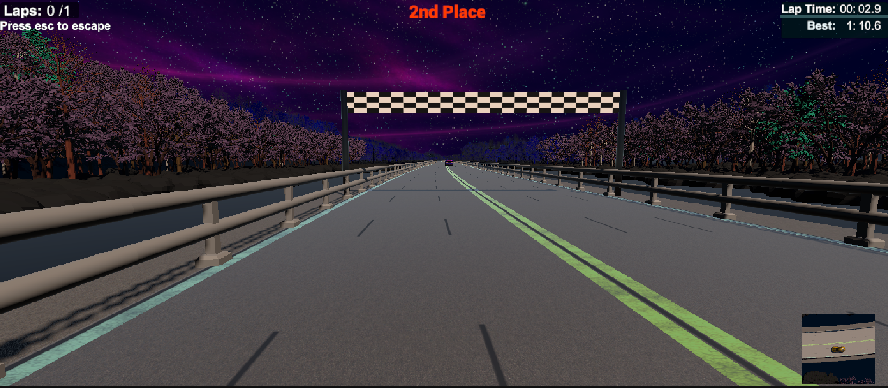
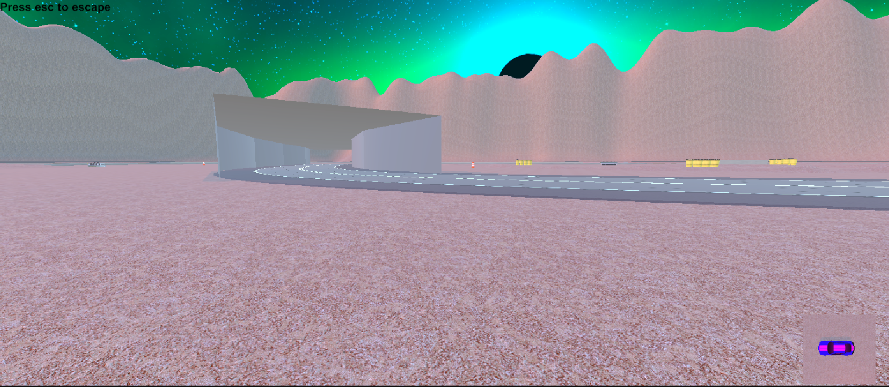

# Car Driving Game (Unity)

A 3D car driving simulation developed in Unity, focused on delivering smooth controls and realistic vehicle physics. This project demonstrates core game development concepts such as player movement, physics handling, and camera systems.

## Overview
This project was built to understand how real-time vehicle mechanics work inside a game environment. It uses Unity’s physics system to simulate natural car movement along with a responsive camera setup for better gameplay experience.

## Features
- Realistic car physics using Wheel Colliders  
- Smooth acceleration, braking, and steering  
- Camera follow system  
- Collision detection with environment  
- Basic road and track setup  

## Technologies Used
- Unity Engine  
- C#  
- Built-in Physics System (Wheel Colliders)  

## Project Structure
- Scripts: Car controller, camera logic, gameplay systems  
- Assets: 3D models, textures, materials  
- Scenes: Main gameplay environment  

## How to Run
1. Open the project in Unity Hub  
2. Load the main scene  
3. Press Play to start  

## Controls
- W / Up Arrow: Accelerate  
- S / Down Arrow: Brake / Reverse  
- A / Left Arrow: Turn Left  
- D / Right Arrow: Turn Right  

## Screenshots

## Purpose
The goal of this project is to strengthen my understanding of Unity game development, especially physics-based vehicle systems and gameplay mechanics.

## Future Improvements
- UI system (speedometer, menus)  
- Sound effects and background music  
- Improved environment design  
- AI traffic system  

---

Feedback and suggestions are always welcome.
